exercise1
1-add user
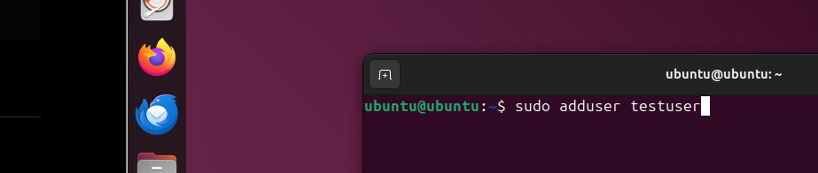
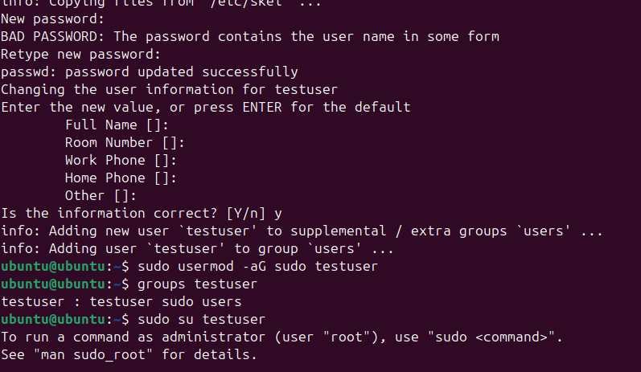
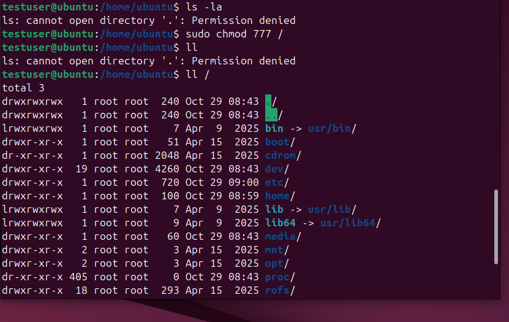
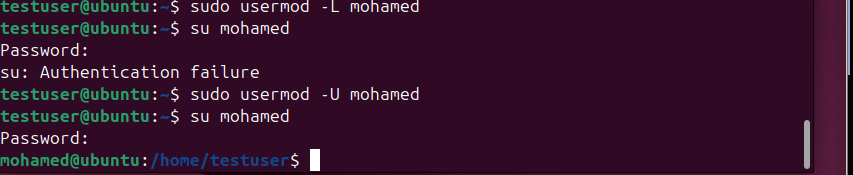
--------------------------------------------------
exercise 2
1-start long run Process
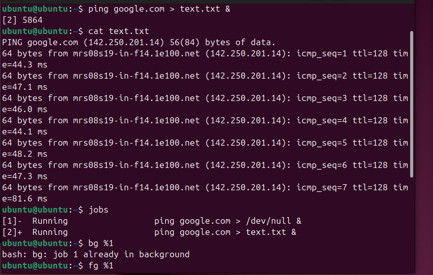
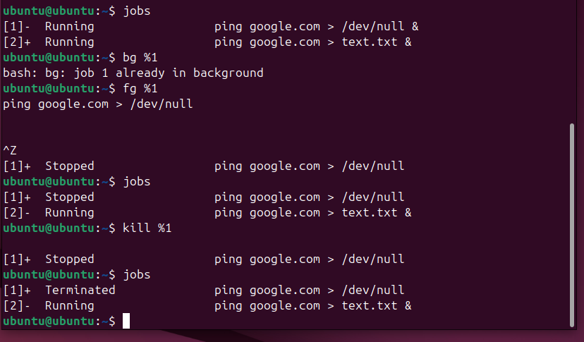
--------------------------------------------------
exercise 3
1-ssh
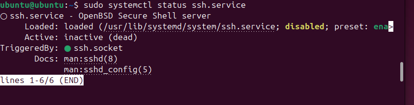
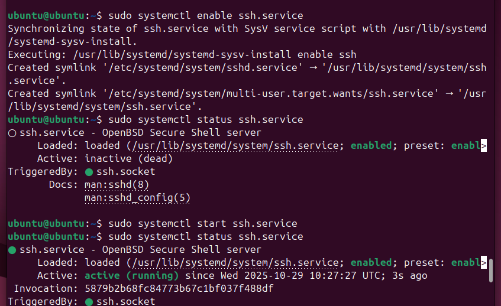
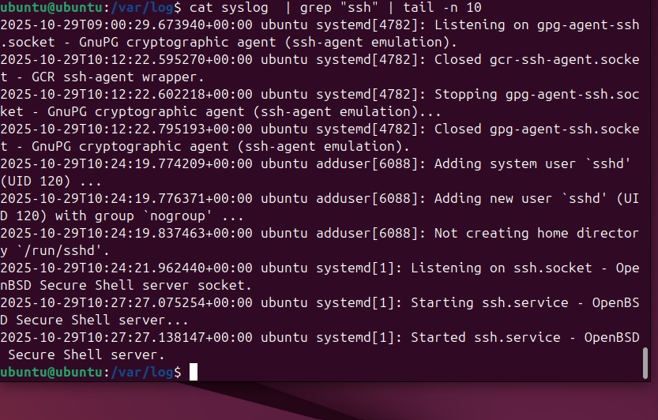
---------------------------------------------------
exercise 4
1- network 
show network interface
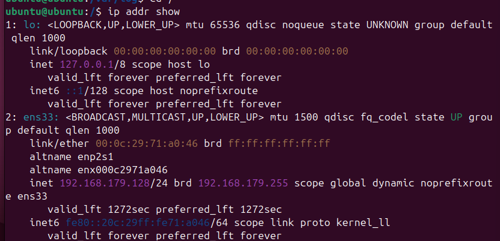
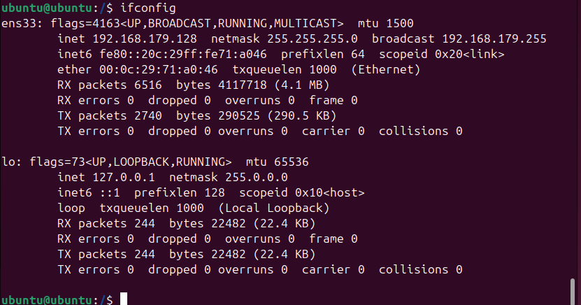  
2- test connectivity
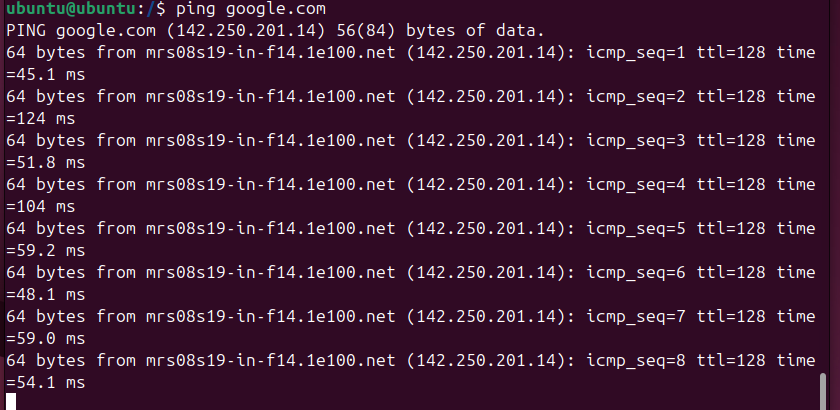  
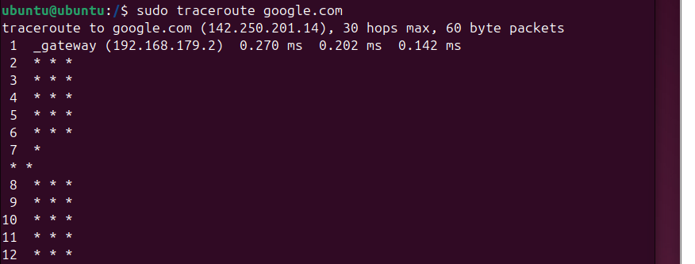
--------------------------------------------------- 

3-test port 22
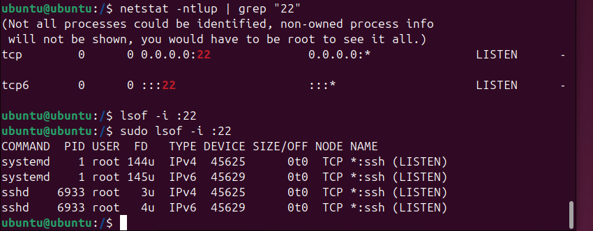    
--------------------------------------------------- 
4- trace route
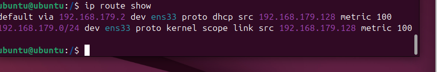
-  --------------------------------------------------
exercise 5
1- view last 50 log
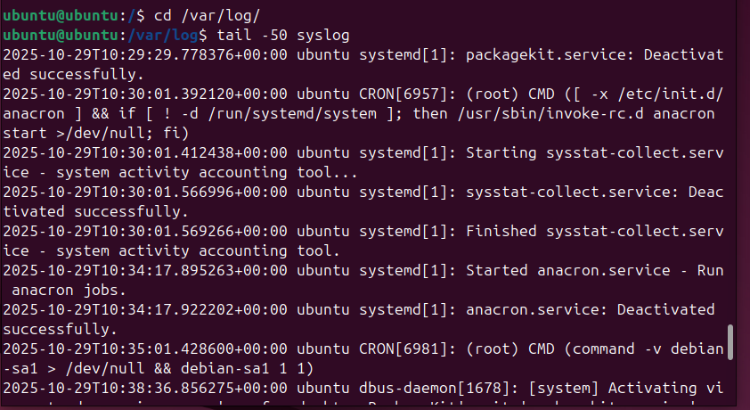  
---------------------------------------------------
2-search for error in log
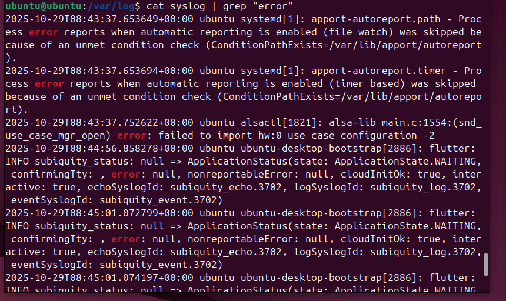
---------------------------------------------------
3-failed login attempt
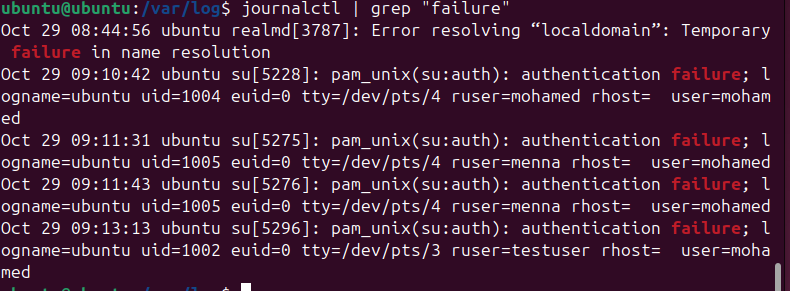
---------------------------------------------------
4- use journalctl
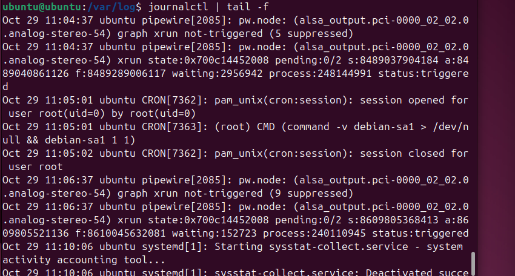
-  -------------------------------------------------
exercise 6
firewall
1-check firewall statues
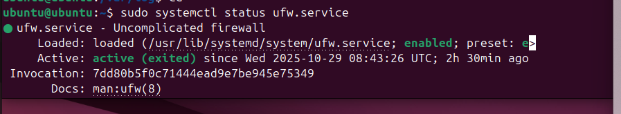
---------------------------------------------------
2-check port 22
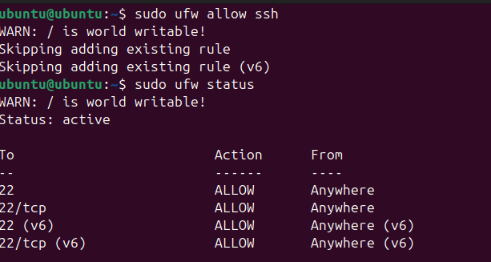
---------------------------------------------------
3- open port 80
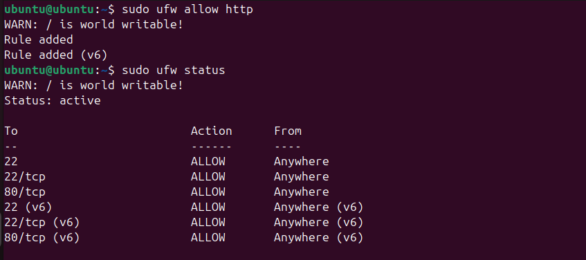
---------------------------------------------------
4-block specific ip & list firewall rules
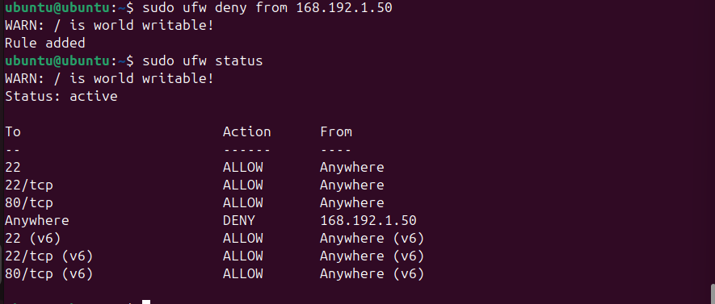
---------------------------------------------------
Home work 
1-create User
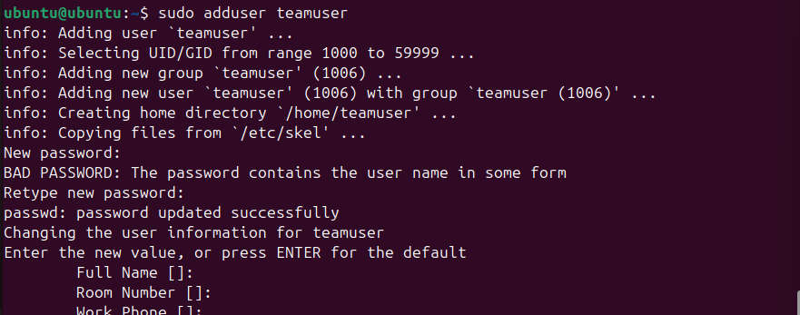
---------------------------------------------------
2-monitor system performance for 10 min
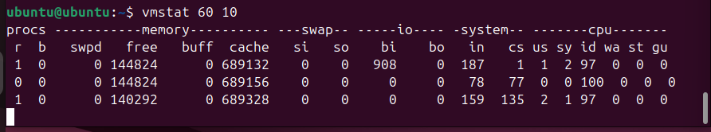
---------------------------------------------------
3-set up custom service 
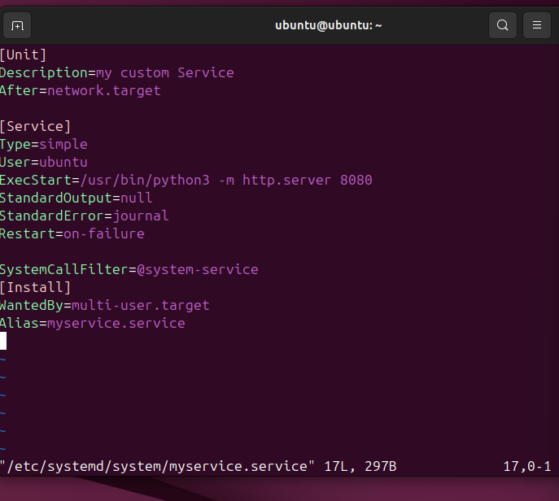   
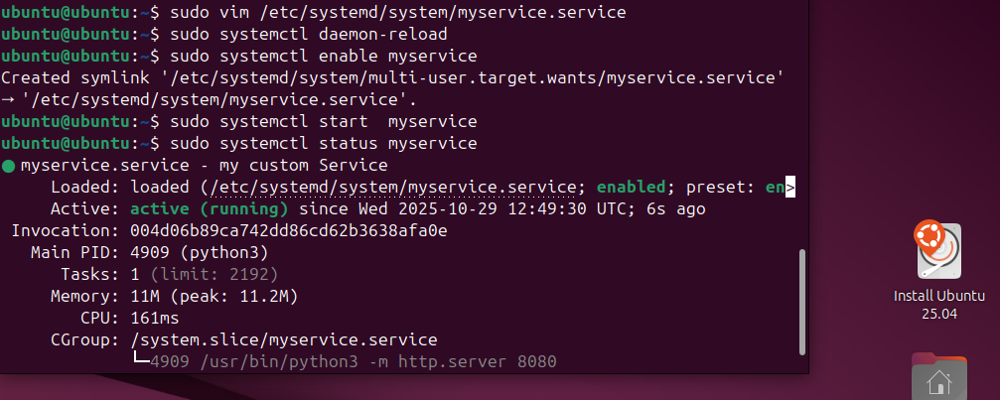
---------------------------------------------------
4- system log for errora and warnings

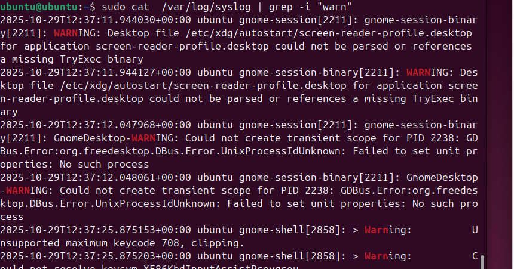
------------------------------------------------------
5- add and remove test package
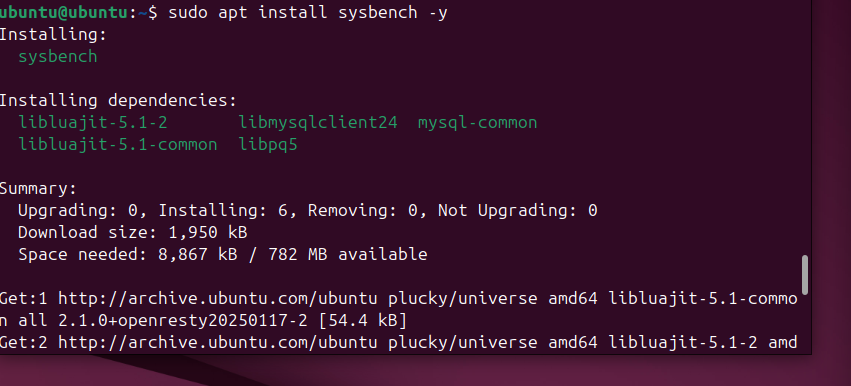
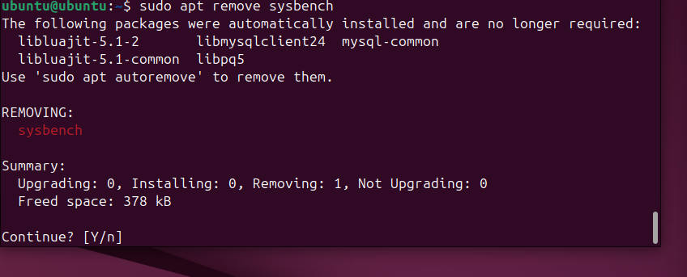
----------------------------------------------------------------
     

